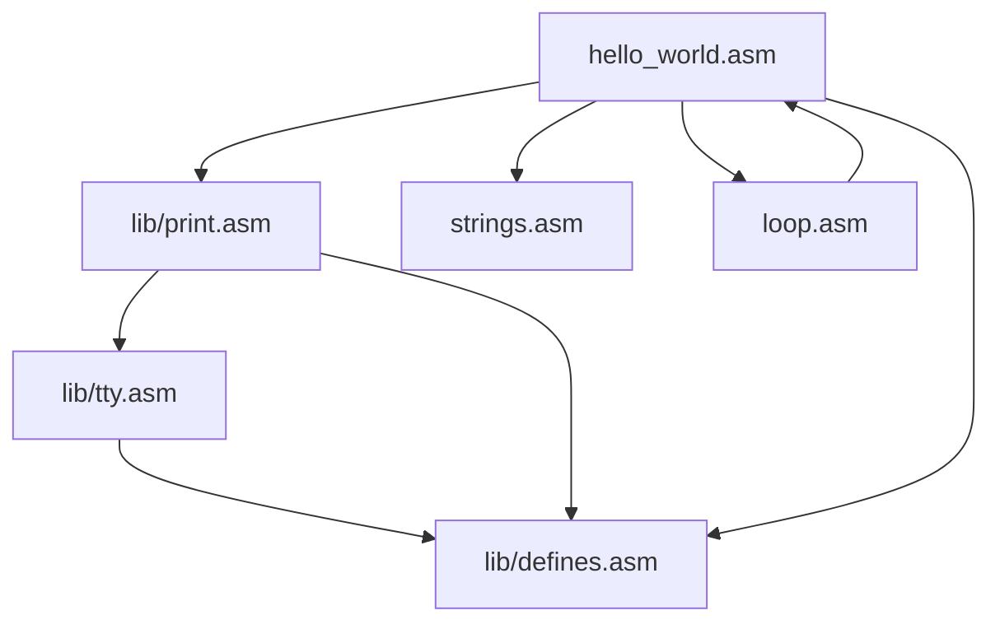

# Imports and Exports

The assembler supports an import and export system for identifiers.

Identifiers are simply either labels, as described in the [Labels document](labels.md), or the identifier part of an assignments as described in the [Assignments document](assignments.md).

## File Exports

To export an identifier you may use an export statement as shown:

```c
    value = 123;
label:
    export value, label;
```

### Inline Exports

You may also prepend the assignment or label declaration with the keyword `export`, this works the same as an export statement, but is more concise:

```c
export value = 123;
export label:
```

## Imports

Let the exports examples in the [File Exports section](#file-exports) be a file named `exports.asm`.

You may import any identifier exported in another file by simply writing an import declaration with each identifier you wish to import:

```c
import value from "exports.asm"; // imports identifier "value"

    value2 = value + 2;
```

The imported file is written relative to the current file (relative to importer).

### Glob Imports

You may also import all exports from another document by using the glob (`*`) import:

```c
import * from "exports.asm"; // imports identifier "value" and "label"

    value2 = value + label;
```

### Import Aliases

You may also import an identifier from another file and alias it to a different name than what was defined by the exporter.

For example:

```c
import value as imported_value, label as imported_label from "exports.asm";

    value = imported_value + imported_label;
label:
```

## Block Exports

Another type of export other than file exports as described in the [File Exports section](#file-exports) is the block export.

Exporting an identifier from within a block allows the enclosing block to reference it. Blocks and scopes are detailed more in the [Scopes document](scopes.md).

For example:

```c
{
    export value = 123;
}

value2 = value + 321;
```

Not including the block level export would cause the identifier `value` to not be found in the expression `value + 321`, as it would not exist in the scope in which the expression is written.

The block exports will only raise an identifier one scope up. If you want to raise it higher, you must use more exports:

```c
{
    {
        export value = 123; // block level export
    }
    export value; // block level export
}
export value; // file level export
```

# Imports Structure in Machine Code

Consider the following import graph:



The machine code will be generated for each file depth first, with already generated files being skipped.

This means multiple imports to the same file does not cause duplications in the machine code; it is generated only once.

The above graph would be generated to machine code in the following order (depth first):

```
<machine code for hello_world.asm>
<machine code for lib/print.asm>
<machine code for lib/tty.asm>
<machine code for lib/defines.asm>
<machine code for strings.asm>
<machine code for loop.asm>
```

This means that the root file will also start at address 0, but there is no guarantee which address imported files will start at.

This also means that if you do not prevent the control flow from going off a file, then it will start executing code from top of the imported files.

For example, consider if `hello_world.asm` was the following:

```c
import print from "lib/print.asm";
import string_address from "strings.asm";
import * from "lib/loop.asm";
import * from "lib/defines.asm";

    ld r0, string_address;
    push r0;
    ld pc.link, print;
```

This would cause the program to print whatever `string_address` is pointing to, but then it will not stop executing and start executing whatever is in `strings.asm`.

To prevent such a case, you can either shutdown (specific to hardware/simulator), or you can loop indefinitely:

```c
import print from "lib/print.asm";
import string_address from "strings.asm";
import * from "lib/loop.asm";
import * from "lib/defines.asm";

    ld r0, string_address;
    push r0;
    ld pc.link, print;
end:
    ld pc, end;
```
